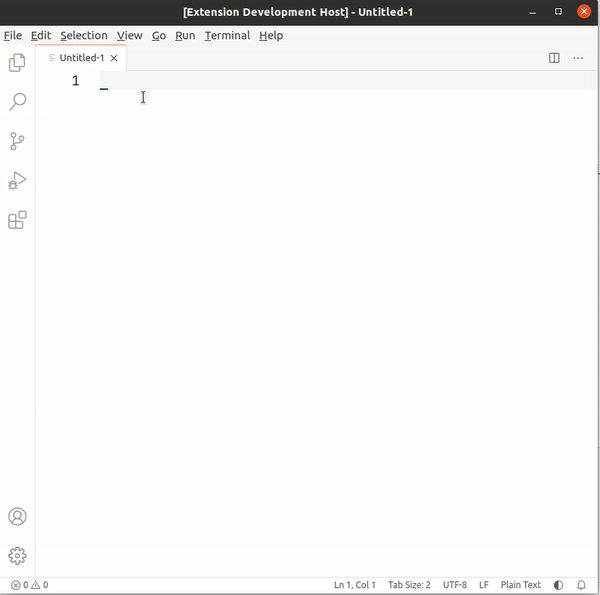
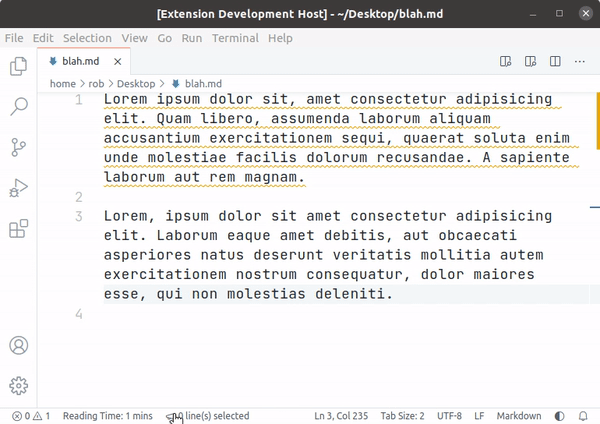

<h1 align="center">
VS Code JavaScript Extension Examples
</h1>

This repository contains **example extensions written in JavaScript**.

The VS Code docs examples are written in TypeScript (found in [https://github.com/microsoft/vscode-extension-examples](https://github.com/microsoft/vscode-extension-examples)). This repo is to provide a JavaScript alternative to these.

Each folder contains a complete extension that explains one topic from the [VS Code API](https://code.visualstudio.com/api/references/vscode-api) or VS Code's [Contribution Points](https://code.visualstudio.com/api/references/contribution-points).

You can expect the following from each example:
- An explanation of its functionality
- A gif or screenshot demonstrating its usage
- Link to a guide on VS Code website, if it has one
- Listing of used VS Code API and Contribution Points

## Prerequisites

You need to have [Node](https://nodejs.org/en/) and [NPM](https://www.npmjs.com/) installed on your system to run the examples. It is recommended to use the Node version used for VS Code which is documented [here](https://github.com/Microsoft/vscode/wiki/How-to-Contribute#prerequisites).

<u>No dev dependencies are required</u> for building extensions.

## Usage

1. Clone this repo. Run `git clone https://github.com/robole/vscode-extension-examples` on the command-line.
1. Open a specific extension example folder in VS Code. You can run `code <example-folder>` on the command-line.
1. Run `npm install` in the terminal to install all node dependencies for the extension.
1. Launch the extension. If there is an existing configuration in `.vscode/launch.json`, you can press `F5` (or select `Run > Start Debugging` from the main menu) to launch the extension in debug mode. If there is no launch config, open the main module (`extension.js`) and press `F5`. You will be prompted to select an Environment - select "VS Code Development Environment". A new VS Code Window will be opened with the extension loaded.

## Getting Started

If you want to begin at the beginning, you can read the [Your First Extension](https://code.visualstudio.com/api/get-started/your-first-extension) guide.

I have added a minimal example of the boilerplate project the guide uses. It may be easier to understand - [Hello World Minimal](helloworld-minimal).

## Examples

### Hello World Minimal

Basic example that shows an information message that says "Hello World!". It has the absolute minimum code required for simplicity sake.

See folder [helloworld-minimal](#helloworld-minimal).

### Document Editing

This example shows you how to create a command that makes changes in a document (of the active text editor). It reverses selected text.

See folder [document-editing](#document-editing).

### Progress Task

This extension shows a progress task in the notification area.

See folder [progress](#progress).

### Status Bar

This extension shows a status bar item that shows how many lines are selected in the active text editor.

See folder [statusbar](#statusbar).
