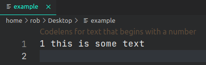

<h1 align="center">VS Code Extension Examples</h1>

This repository contains **example extensions written in JavaScript**.

The VS Code docs [examples](https://github.com/microsoft/vscode-extension-samples) are written in TypeScript. The purpose of this repo is to provide clear, simple JavaScript alternatives to these.

Each folder contains a complete extension that explains one topic from the [VS Code API](https://code.visualstudio.com/api/references/vscode-api) or VS Code's [Contribution Points](https://code.visualstudio.com/api/references/contribution-points).

You can expect the following from each example:
- An explanation of its functionality
- A gif or screenshot demonstrating its usage
- Listing of used VS Code API and Contribution Points
- Link to a guide on VS Code website, if it has one

**You can read this guide [Writing VS Code extensions in JavaScript](https://blog.logrocket.com/writing-vs-code-extensions-in-javascript/) to get up and running quickly.** It gives a clear overview of the important namespaces and breaks down some of the jargon of the API. It covers some of the examples from this repo.

## Prerequisites

You need to have [Node](https://nodejs.org/en/) and [NPM](https://www.npmjs.com/) installed on your system to run the examples. It is recommended to use the Node version used for VS Code which is documented [here](https://github.com/Microsoft/vscode/wiki/How-to-Contribute#prerequisites). I use node v15 and have had no issues.

<u>No dev dependencies are required for building extensions.</u> By default, Node and the VS Code API is available to use in an extension.

## Usage

1. Clone this repo. Run `git clone https://github.com/robole/vscode-extension-examples` on the command-line.
1. Open a specific extension example folder in VS Code. You can run `code <example-folder>` on the command-line.
1. Run `npm install` in the terminal to install all node dependencies for the extension. Most of these examples do not require any dependencies.
1. Launch the extension. If there is an existing configuration in `.vscode/launch.json`, you can press `F5` (or select `Run > Start Debugging` from the main menu) to launch the extension in debug mode. If there is no launch config, open the main module (`extension.js`) and press `F5`. You will be prompted to select an Environment - select "VS Code Development Environment". A new VS Code Window will be opened with the extension loaded.

## Getting Started

In the article [Writing VS Code extensions in JavaScript](https://blog.logrocket.com/writing-vs-code-extensions-in-javascript/), I start at the beginning and discuss how to set-up a project, and create the [Hello World Minimal](helloworld-minimal) example featured here.

The [Hello World Minimal](helloworld-minimal) example is the same as the boilerplate project the official guide use, but it may be easier to understand as I omit unnecessary details and code.

## Examples

<!-- TOC -->
List:
1. [Codelens](#codelens)
1. [Decorator](#decorator)
1. [Document Editing](#document-editing)
1. [Hello World Minimal](#hello-world-minimal)
1. [Hover Provider](#hover-provider)
1. [Progress](#progress)
1. [Quickpick Simple](#quickpick-simple)
1. [Quickpick Advanced with Separator](#quickpick-advanced-with-separator)
1. [Status Bar](#status-bar)
1. [Treeview Simple](#treeview-simple)
1. [Webview Simple](#webview-simple)
<!-- /TOC -->

### Codelens

- **Description**: A codelens represents a command that is shown inline in source code. This example adds a codelens to the document for lines of text that begin with a number.
- **API References**:
	- [`languages.registerCodeLensProvider`](https://code.visualstudio.com/api/references/vscode-api#languages.registerCodeLensProvider)
	- [`CodeLensProvider`](https://code.visualstudio.com/api/references/vscode-api#CodeLensProvider)
- **Folder**: [codelens](/codelens).
- **Command**: `Example: Show codelens`.

### Decorator

 

- **Description**: Demonstrates adding text decoration to particular parts of a document. In this case, every number is decorated with a blue border, and custom text is added to the popup when you hover over the number.
- **API References**:
	- [`TexEditor.setDecorations`](https://code.visualstudio.com/api/references/vscode-api#TextEditor.setDecorations)
	- [`window.createTextEditorDecorationType`](https://code.visualstudio.com/api/references/vscode-api#window.createTextEditorDecorationType)
- **Folder**: [decorator](/decorator).
- **Command** : Not applicable. Runs on startup.

### Document Editing

- **Description**: Makes changes to text in a document (of the active text editor). The examples reverses selected text.
- **API References**:
	- [`window.activeTextEditor`](https://code.visualstudio.com/api/references/vscode-api#window.activeTextEditor)
	- [`TextDocument.getText`](https://code.visualstudio.com/api/references/vscode-api#TextDocument.getText)
	- [`TextEditor.edit`](https://code.visualstudio.com/api/references/vscode-api#TextEditor.edit)
- **Folder**: [document-editing](/document-editing).
- **Command**: `Example: Reverse Selected Text`.

### Hello World Minimal

 

- **Description**: Basic example that shows an information message that says "Hello World!". It pop ups in the bottom right corner.
- **API References**:
	- [`window.showInformationMessage`](https://code.visualstudio.com/api/references/vscode-api#window.showInformationMessage)
- **Folder**: [helloworld-minimal](/helloworld-minimal).
- **Command** :`Example: Hello World`.

### Hover Provider

 

- **Description**: Creates a hover popup for every word in javascript files. It executes a command to opens the Search sidebar searching for the word you hovered over in the workspace files.
- **API References**:
	- [`vscode.languages.registerHoverProvider`](https://code.visualstudio.com/api/references/vscode-api#languages.registerHoverProvider)
- **Folder**: [hover-provider](/hover-provider).
- **Command** : None.
-- **Activation**: Open a JavaScript file. Hover over a word to see the hover popup.

### Progress

- **Description**: Show progress message for a running task. It pop ups in the bottom right corner.
- **API References**:
	- [`window.withProgress`](https://code.visualstudio.com/api/references/vscode-api#window.withProgress)
- **Folder**: [progress](/progress).
- **Command**: `Example: Show Progress`.

### Quickpick Simple

#### Single Selection Quickpick

- **Description**: A quickpick is a dropdown combobox that is opened in the Command Palette. This is allows you to select a single item.
- **Command**: `Example: Show Basic Quickpick`.

#### Multiple Selection Quickpick

- **Description**: A quickpick is a dropdown combobox that is opened in the Command Palette. This example shows the ability to select multiple items.
- **Command**: `Example: Show Multi Quickpick`.

References:
- **API References**:
	- [window.showQuickPick](https://code.visualstudio.com/api/references/vscode-api#window.showQuickPick)
	- [QuickPickOptions](https://code.visualstudio.com/api/references/vscode-api#QuickPickOptions)
- **Folder**: [quickpick-simple](/quickpick-simple).

### Quickpick Advanced with Separator

- **Description**: A quickpick is a dropdown combobox that is opened in the Command Palette. This example shows how to create a quickpick with sections, with a horiztonal line (hard to see in my theme) and a left-aligned label. This is achieved by using a `QuickPickItem` with a `kind` of `QuickPickItemKind.Separator`.
- **API References**:
	- [window.createQuickPick](https://code.visualstudio.com/api/references/vscode-api#window.createQuickPick)
	- [QuickPickItem](https://code.visualstudio.com/api/references/vscode-api#QuickPickItem)
	- [QuickPickItemKind](https://code.visualstudio.com/api/references/vscode-api#QuickPickItem)
	- [QuickPickOptions](https://code.visualstudio.com/api/references/vscode-api#QuickPickOptions)
- **Folder**: [quickpick-advanced-separator](/quickpick-advanced-separator).
- **Command**: `Example: Show Advanced Quickpick with Separator`.

### Status Bar

- **Description**: Add item to status bar (the bar at the very bottom of the window). Clicking on the item executes a command.
- **API References**:
	- [`window.createStatusBarItem`](https://code.visualstudio.com/api/references/vscode-api#window.createStatusBarItem)
- **Folder**: [statusbar](/statusbar).
- **Command**: None. Just run the extension to see status bar item.

### Treeview Simple

- **Description**: A simple example of a treeview that shows a list of users. It is added to the **Explorer** view container.
- **API References**:
	- [window.createTreeView](https://code.visualstudio.com/api/references/vscode-api#window.createTreeView)
	- [TreeView](https://code.visualstudio.com/api/references/vscode-api#TreeView)
	- [TreeItem](https://code.visualstudio.com/api/references/vscode-api#TreeItem)
	- [TreeDataProvider](https://code.visualstudio.com/api/references/vscode-api#TreeDataProvider)
- **Official Guide**: The [Treeview guide](https://code.visualstudio.com/api/extension-guides/treeview) covers a more complicated example.
- **Folder**: [treeview-simple](/treeview-simple).
- **Command**: None. Just run the extension.

### Webview Simple

- **Description**: A simple example of a webview.
- **API References**:
	- [`window.createWebviewPanel`](https://code.visualstudio.com/api/references/vscode-api#window.createWebviewPanel)
- **Official Guide**: [Webview guide](https://code.visualstudio.com/api/extension-guides/webview) covers a more complicated example.
- **Folder**: [webview-simple](/webview-simple).
- **Commands**:
	- `Cat Coding: Start cat coding session`: Open the webview.
	- `Cat Coding: Do some refactoring`: Make a refactor event to change content of webview.

## Make a contribution

If you are interested in adding an example, feel free to make a Pull Request. I prefer simpler examples with clean code. If there is a simple example for a particular part of the API, a more advanced example is good also.

I refactored some of some examples from [https://github.com/microsoft/vscode-extension-samples](https://github.com/microsoft/vscode-extension-samples). You could do the same if you wish.

## Show appreciation

You can show your appreciation by [buying me a coffee or sponsoring me](https://ko-fi.com/roboleary).

You can star the repo to help others find it. 🌟
