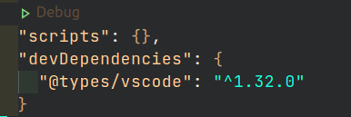
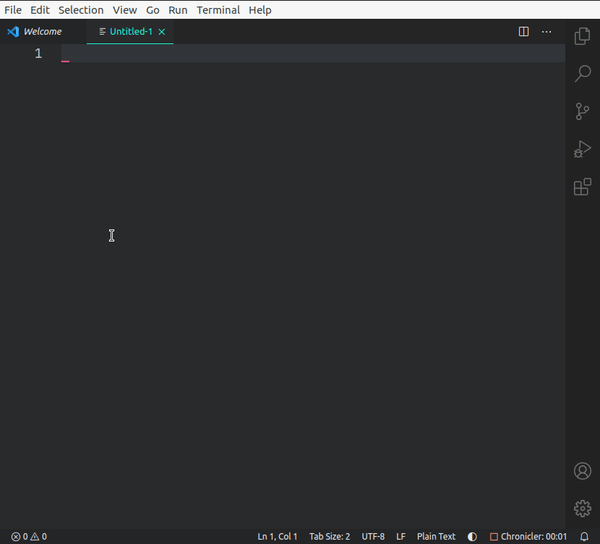
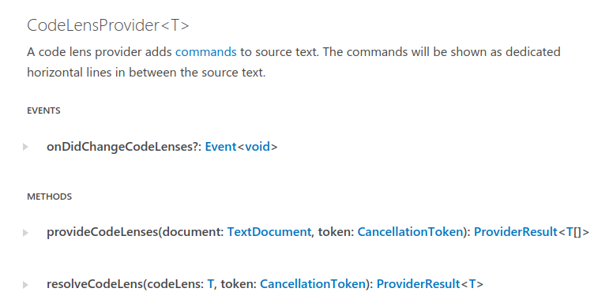

# Codelens

A codelens represents a command that is shown inline in source code. It is a way to run actions on related code quickly, such as this debug action you see in `package.json`.



This example adds a codelens to the document for lines of text that begin with a number. The command shows an information message displaying the line number and text.



To try the example out:
- Create a new file
- Write a line of text that begins with a number
- Click on the CodeLens to run the command.

## Understanding the API

The API around this topic is quite abstract and hard to explain. I will do my best here!

You don't create a codelens and add it to a document directly. You do not need to handle events to take care of when a codelens is added,updated, or removed from the document. A codelens must be provided through a CodeLensProvider, which takes care of this for you.

A CodeLensProvider is associated with a programming language through `languages.registerCodeLensProvider`. In this example it associated with all languages, and we give it our custom CodeLensProvider.

```javascript
vscode.languages.registerCodeLensProvider(
    "*",
    new Provider()
);
```

CodeLensProvider does not have a constructor. You can create your own object (the class `Provider` in this example) and have it implement 2 functions with the same signature as per the API.



```javascript
class Provider {
  constructor() {
    //match any text that begins with a number
    this.regex = new RegExp(/\d+.*/g);
  }

  provideCodeLenses(document, token) {
    //...
  }

  resolveCodeLens(codeLens, token) {
    //...
  }
}
```

The expectation is that:
- `provideCodeLenses` will create codelenses and associate them with a range in the document. These codelenses are considered unresolved as they do not have a command associated.
- `resolveCodeLens` will associate a command with a codelens and "resolve" them.

You can pass values from the codelens to the command by arguments.

```javascript
let lineNum = 1;
let text = "banana";

 codeLens.command = {
        title: "Just another Codelens",
        command: "example.show",
        arguments: [lineNum, text],
};
```

I recommend reading through the code to get a complete understanding.

## VS Code API

- [`languages.registerCodeLensProvider`](https://code.visualstudio.com/api/references/vscode-api#languages.registerCodeLensProvider)

- [`CodeLensProvider`](https://code.visualstudio.com/api/references/vscode-api#CodeLensProvider)

## Running the Extension

- Press <kbd>F5</kbd> to run the "Launch Extension" Debug Configuration. This will run the extension in a new VS Code window.
- Create a new file
- Write a line of text that begins with a number e.g. "1 eg"
- Click on the codeLens to run the command and show an information message.
