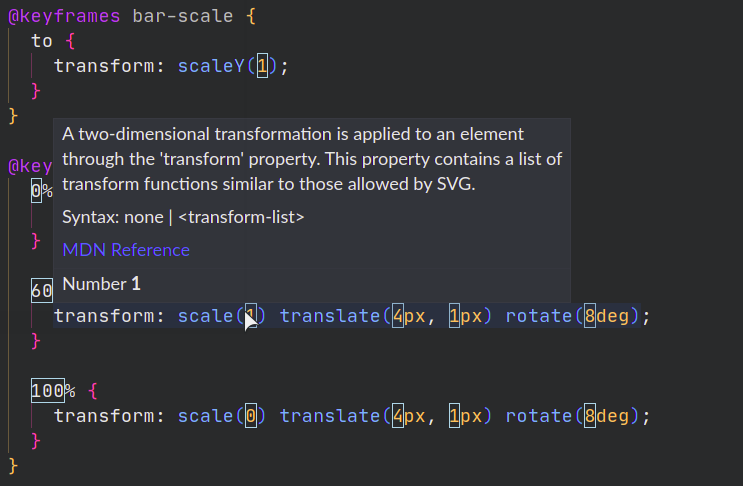

# Decorator

The example creates a decoration for each number that appears in the active text editor. It adds a colored border around each number.

Also, when you hover over the decorator, some custom text is appended to popup. It says "Number {x}", where *{x}* is the actual number.



It is a good idea to throttle updating decorators too, as it can slow the UI otherwise.

## Extension Manifest (`package.json`)

No dependencies are required.

These are the minimum required fields:

```json
{
  "name": "decorator-example",
  "version": "0.0.1",
  "engines": {
    "vscode": "^1.32.0"
  },
  "activationEvents": [
    "onStartupFinished"
  ],
  "main": "extension.js"
}
```

If you are publishing an extension, you should consider adding more metadata. Adding anything else is at your own discretion.

## VS Code API Reference

### `vscode` module

- [`TexEditor.setDecorations`](https://code.visualstudio.com/api/references/vscode-api#TextEditor.setDecorations)
- [`window.createTextEditorDecorationType`](https://code.visualstudio.com/api/references/vscode-api#window.createTextEditorDecorationType)

## Running the Extension

- Run `npm install` on the command-line to install the dev dependencies.
- Press <kbd>F5</kbd> to run the "Launch Extension" Debug Configuration. This will run the extension in a new VS Code window.
- Open up any file with numbers in it!
