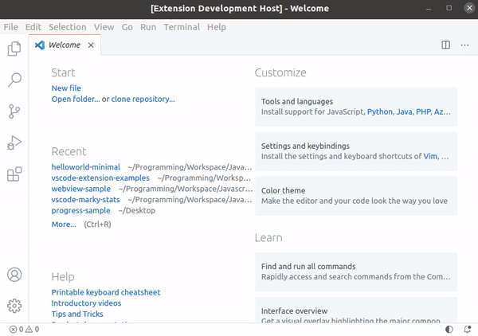

# Hello World Minimal

This is a minimal "Hello World" example of an extension.  

**It has the command "Hello World"**, which shows a pop-up message saying "Hello World!".



## Extension Manifest (`package.json`)

No dependencies are required.

These are the minimum required fields:

```json
{
  "name": "example",
  "version": "0.0.1",
  "engines": {
    "vscode": "^1.32.0"
  },
  "activationEvents": [
    "onCommand:example.helloWorld"
  ],
  "main": "extension.js",
  "contributes": {
    "commands": [
      {
        "command": "example.helloWorld",
        "title": "Hello World"
      }
    ]
  }
}
```

If you are publishing an extension, you should consider adding more metadata. Adding anything else is at your own discretion.

## VS Code API Reference

### `vscode` module

- [`commands.registerCommand`](https://code.visualstudio.com/api/references/vscode-api#commands.registerCommand)
- [`window.showInformationMessage`](https://code.visualstudio.com/api/references/vscode-api#window.showInformationMessage)

### Contribution Points

- [`contributes.commands`](https://code.visualstudio.com/api/references/contribution-points#contributes.commands)

## Running the Extension

- Run `npm install` on the command-line to install the dev dependencies.
- Press <kbd>F5</kbd> to run the "Launch Extension" Debug Configuration. This will run the extension in a new VS Code window.
- Select the command "Hello World" from the Command Palette (<kbd>Ctrl+Shift+p</kbd>). This will show a pop-up message saying "Hello World!".
