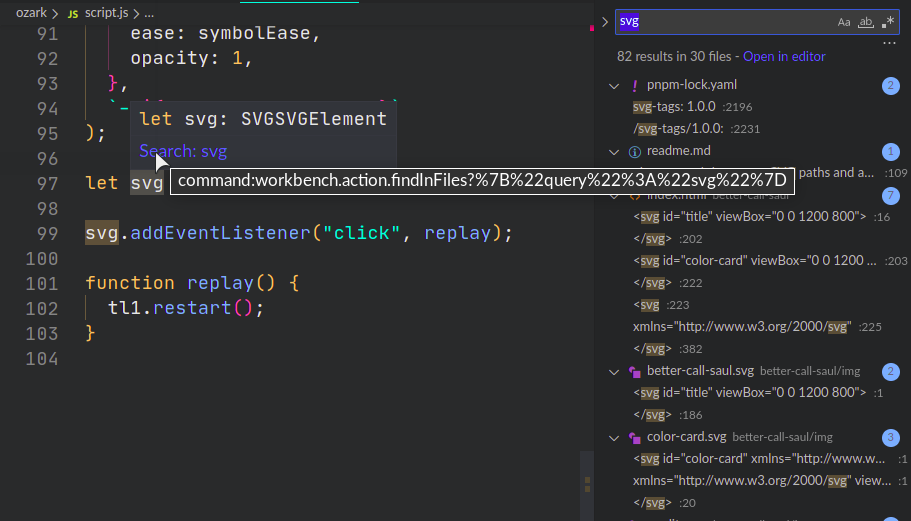

# Hover Provider

The example creates a hover popup for every word in javascript files. It executes the `workbench.action.findInFiles` command, passing it the word you are hovering over as an argument, this opens the Search sidebar with to search for that word in the workspace files.



Note that this is appended to the popup text. If there is other information provided for that word from docs such as Mozilla Developer Network, then it will be at the very end of that text. You will need to scroll down to see it!

## Extension Manifest (`package.json`)

No dependencies are required.

These are the minimum required fields:

```json
{
  "name": "hover-provider-example",
  "version": "0.0.1",
  "engines": {
    "vscode": "^1.32.0"
  },
  "activationEvents": [
    "onLanguage:javascript"
  ],
  "main": "extension.js"
}
```

If you are publishing an extension, you should consider adding more metadata. Adding anything else is at your own discretion.

## VS Code API Reference

### `vscode` module

- [`vscode.languages.registerHoverProvider`](https://code.visualstudio.com/api/references/vscode-api#languages.registerHoverProvider)

## Running the Extension

- Run `npm install` on the command-line to install the dev dependencies.
- Press <kbd>F5</kbd> to run the "Launch Extension" Debug Configuration. This will run the extension in a new VS Code window.
- Open a JavaScript file and hover over a word.
