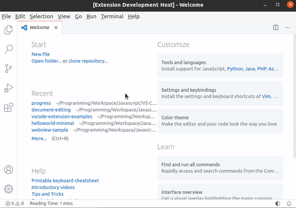
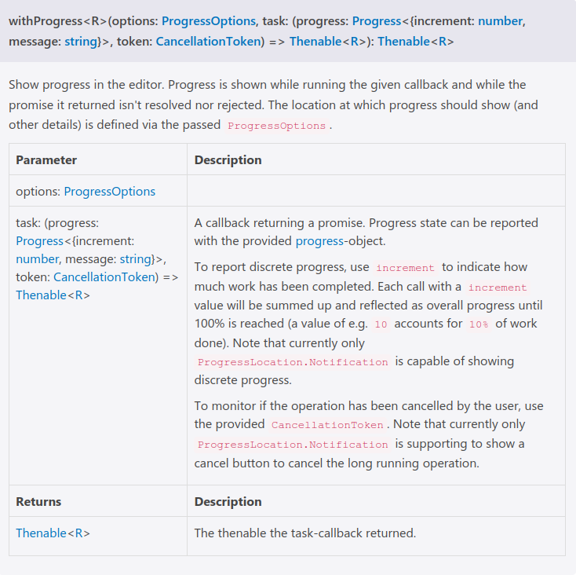

# Progress

This extension shows a progress task in the notification area.

**Run the command "Show Progress" from the Command Palette** to kick off the progress task.

## VS Code API Referene

### `vscode` module

- [`commands.registerCommand`](https://code.visualstudio.com/api/references/vscode-api#commands.registerCommand)
- The extension uses the [`window.withProgress`](https://code.visualstudio.com/api/references/vscode-api#window.withProgress) function to show the task in the notification area.

- [`ProgressOptions`](https://code.visualstudio.com/api/references/vscode-api#ProgressOptions)
- [`CancellationToken`](https://code.visualstudio.com/api/references/vscode-api#CancellationToken)

### Contribution Points

- [`contributes.commands`](https://code.visualstudio.com/api/references/contribution-points#contributes.commands)

## Running the Extension

- Run `npm install` on the command-line to install the dev dependencies.
- Press <kbd>F5</kbd> to run the "Launch Extension" Debug Configuration. This will run the extension in a new VS Code window.
- Run the command "Show Progress" from the Command Palette to kick off the progress task.
