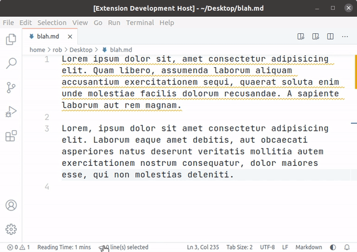

# Status Bar

This extension adds a status bar entry showing the current number of selected lines. It is positioned on the left-hand-side.

## VS Code API References

Below are references to parts of the API used in the code.

### `vscode` module

- [`commands.registerCommand`](https://code.visualstudio.com/api/references/vscode-api#commands.registerCommand)
- [`window.createStatusBarItem`](https://code.visualstudio.com/api/references/vscode-api#window.createStatusBarItem)
- [`window.activeTextEditor`](https://code.visualstudio.com/api/references/vscode-api#window.activeTextEditor)
- [`window.onDidChangeActiveTextEditor`](https://code.visualstudio.com/api/references/vscode-api#window.onDidChangeActiveTextEditor)
- [`window.onDidChangeTextEditorSelection`](https://code.visualstudio.com/api/references/vscode-api#window.onDidChangeTextEditorSelection)

### Contribution Points

- [`contributes.commands`](https://code.visualstudio.com/api/references/contribution-points#contributes.commands)

## Running the Extension

- Run `npm install` in terminal to install dependencies.
- Press <kbd>F5</kbd> to run the "Launch Extension" Debug Configuration. This will run the extension in a new VS Code window.
- The status bar item will be visible as soon as the extension is loaded.
