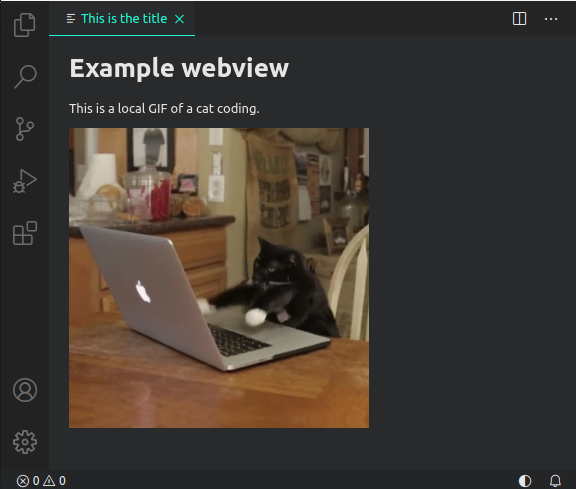

# Webview Simple

A simple webview. A webview is a fully customizable views that can be built with HTML, CSS, and JavaScript. For example, the built-in Markdown extension uses webviews to render Markdown previews.

**You can open the webview by running the command "Show example webview".**

This includes:

- Creating and showing a basic webview.
- Loading a local stylesheet and image in a webview.

You can read the [Webview guide](https://code.visualstudio.com/api/extension-guides/webview) to build something more complete.

## VS Code API References

Below are references to parts of the API used in the code.

### `vscode` module

- [`window.createWebviewPanel`](https://code.visualstudio.com/api/references/vscode-api#window.createWebviewPanel)

## Running the example

- Press <kbd>F5</kbd> to run the "Launch Extension" Debug Configuration. This will run the extension in a new VS Code window.
- The status bar item will be visible as soon as the extension is loaded.
- You can open the webview by running the command "Show example webview" from the Command Palette.
